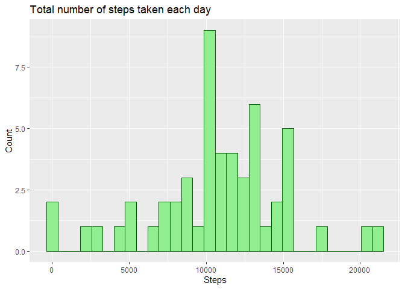
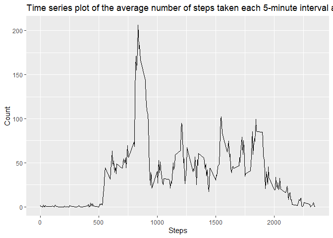
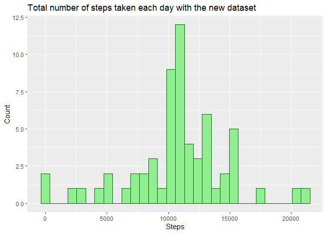
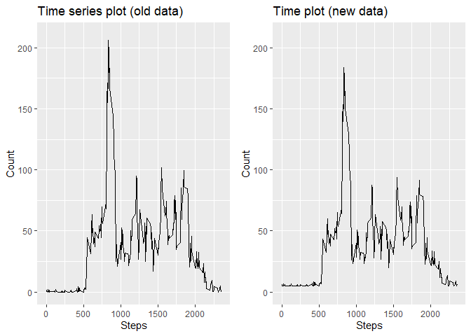
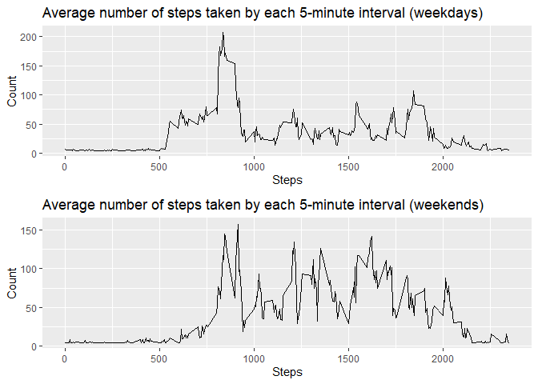

**Assignment done by Juan Pablo Loaiza Ramírez**

## Loading and preprocessing the data
1. Unzip the file "activity.zip", which is in the working directory.

```r
unzip(zipfile = "activity.zip", exdir = getwd())
```

2. Assign the data of the .csv file to *data*. This object reads the data with a header, with "NA" as missing valus, and reads 17,568 columns.

```r
data <- read.csv(file = "activity.csv", header = TRUE, na.strings = "NA", nrows = 17568)
```

3. Upload the libraries that will be used: *dplyr* to summarize efficiently and *ggplot2* to plot. If any library is not installed yet, execute *install.packages("name_of_the_package")* to install it.

```r
library(dplyr)
library(ggplot2)
```

4. Set the column *date* of the dataset as actual dates, because it was read as character.

```r
data$date <- as.Date(data$date)
```

## What is mean total number of steps taken per day?

1. Exclude NA values, group the data by date and sum the total of steps by date. The result is assign into *sumSteps*.

```r
sumSteps <- data %>% filter(steps != "NA") %>% group_by(date) %>% summarize(steps = sum(steps))
```

2. Create a histogram of the total number of steps taken each day.

```r
ggplot(sumSteps, aes(x = steps)) + geom_histogram(color = "darkgreen", fill = "lightgreen") + labs(title = "Total number of steps taken each day", x = "Steps", y = "Count")
```

<!-- -->

3. Calculate and report the mean (*meanStepsPerDay*) and median (*medianStepsPerDay*) of the total number of steps taken per day.

```r
meanStepsPerDay <- data %>% filter(steps != "NA") %>% group_by(date) %>% summarize(meanStepsPerDay = mean(steps))
as.matrix(meanStepsPerDay)
```

```
##       date         meanStepsPerDay
##  [1,] "2012-10-02" " 0.4375000"   
##  [2,] "2012-10-03" "39.4166667"   
##  [3,] "2012-10-04" "42.0694444"   
##  [4,] "2012-10-05" "46.1597222"   
##  [5,] "2012-10-06" "53.5416667"   
##  [6,] "2012-10-07" "38.2465278"   
##  [7,] "2012-10-09" "44.4826389"   
##  [8,] "2012-10-10" "34.3750000"   
##  [9,] "2012-10-11" "35.7777778"   
## [10,] "2012-10-12" "60.3541667"   
## [11,] "2012-10-13" "43.1458333"   
## [12,] "2012-10-14" "52.4236111"   
## [13,] "2012-10-15" "35.2048611"   
## [14,] "2012-10-16" "52.3750000"   
## [15,] "2012-10-17" "46.7083333"   
## [16,] "2012-10-18" "34.9166667"   
## [17,] "2012-10-19" "41.0729167"   
## [18,] "2012-10-20" "36.0937500"   
## [19,] "2012-10-21" "30.6284722"   
## [20,] "2012-10-22" "46.7361111"   
## [21,] "2012-10-23" "30.9652778"   
## [22,] "2012-10-24" "29.0104167"   
## [23,] "2012-10-25" " 8.6527778"   
## [24,] "2012-10-26" "23.5347222"   
## [25,] "2012-10-27" "35.1354167"   
## [26,] "2012-10-28" "39.7847222"   
## [27,] "2012-10-29" "17.4236111"   
## [28,] "2012-10-30" "34.0937500"   
## [29,] "2012-10-31" "53.5208333"   
## [30,] "2012-11-02" "36.8055556"   
## [31,] "2012-11-03" "36.7048611"   
## [32,] "2012-11-05" "36.2465278"   
## [33,] "2012-11-06" "28.9375000"   
## [34,] "2012-11-07" "44.7326389"   
## [35,] "2012-11-08" "11.1770833"   
## [36,] "2012-11-11" "43.7777778"   
## [37,] "2012-11-12" "37.3784722"   
## [38,] "2012-11-13" "25.4722222"   
## [39,] "2012-11-15" " 0.1423611"   
## [40,] "2012-11-16" "18.8923611"   
## [41,] "2012-11-17" "49.7881944"   
## [42,] "2012-11-18" "52.4652778"   
## [43,] "2012-11-19" "30.6979167"   
## [44,] "2012-11-20" "15.5277778"   
## [45,] "2012-11-21" "44.3993056"   
## [46,] "2012-11-22" "70.9270833"   
## [47,] "2012-11-23" "73.5902778"   
## [48,] "2012-11-24" "50.2708333"   
## [49,] "2012-11-25" "41.0902778"   
## [50,] "2012-11-26" "38.7569444"   
## [51,] "2012-11-27" "47.3819444"   
## [52,] "2012-11-28" "35.3576389"   
## [53,] "2012-11-29" "24.4687500"
```

```r
medianStepsPerDay <- data %>% filter(steps != "NA") %>% group_by(date) %>% summarize(medianStepsPerDay = median(steps))
as.matrix(medianStepsPerDay)
```

```
##       date         medianStepsPerDay
##  [1,] "2012-10-02" "0"              
##  [2,] "2012-10-03" "0"              
##  [3,] "2012-10-04" "0"              
##  [4,] "2012-10-05" "0"              
##  [5,] "2012-10-06" "0"              
##  [6,] "2012-10-07" "0"              
##  [7,] "2012-10-09" "0"              
##  [8,] "2012-10-10" "0"              
##  [9,] "2012-10-11" "0"              
## [10,] "2012-10-12" "0"              
## [11,] "2012-10-13" "0"              
## [12,] "2012-10-14" "0"              
## [13,] "2012-10-15" "0"              
## [14,] "2012-10-16" "0"              
## [15,] "2012-10-17" "0"              
## [16,] "2012-10-18" "0"              
## [17,] "2012-10-19" "0"              
## [18,] "2012-10-20" "0"              
## [19,] "2012-10-21" "0"              
## [20,] "2012-10-22" "0"              
## [21,] "2012-10-23" "0"              
## [22,] "2012-10-24" "0"              
## [23,] "2012-10-25" "0"              
## [24,] "2012-10-26" "0"              
## [25,] "2012-10-27" "0"              
## [26,] "2012-10-28" "0"              
## [27,] "2012-10-29" "0"              
## [28,] "2012-10-30" "0"              
## [29,] "2012-10-31" "0"              
## [30,] "2012-11-02" "0"              
## [31,] "2012-11-03" "0"              
## [32,] "2012-11-05" "0"              
## [33,] "2012-11-06" "0"              
## [34,] "2012-11-07" "0"              
## [35,] "2012-11-08" "0"              
## [36,] "2012-11-11" "0"              
## [37,] "2012-11-12" "0"              
## [38,] "2012-11-13" "0"              
## [39,] "2012-11-15" "0"              
## [40,] "2012-11-16" "0"              
## [41,] "2012-11-17" "0"              
## [42,] "2012-11-18" "0"              
## [43,] "2012-11-19" "0"              
## [44,] "2012-11-20" "0"              
## [45,] "2012-11-21" "0"              
## [46,] "2012-11-22" "0"              
## [47,] "2012-11-23" "0"              
## [48,] "2012-11-24" "0"              
## [49,] "2012-11-25" "0"              
## [50,] "2012-11-26" "0"              
## [51,] "2012-11-27" "0"              
## [52,] "2012-11-28" "0"              
## [53,] "2012-11-29" "0"
```

## What is the average daily activity pattern?

1. Calculate the average number of steps taken across all days by each 5-minute intervals. The result is assign to *aveStepsbyInterval*.

```r
aveStepsbyInterval <- data %>% filter(steps != "NA") %>% group_by(interval) %>% summarize(averageSteps = mean(steps))
```

2. Time series plot of the 5-minute interval (x-axis) and the average number of steps taken, averaged across all days (y-axis).

```r
ggplot(aveStepsbyInterval, aes(x = interval, y = averageSteps)) + geom_line() + labs(title = "Time series plot of the average number of steps taken each 5-minute interval across all days", x = "Steps", y = "Count")
```

<!-- -->

3. 5-minute interval, on average across all the days in the dataset, that contains the maximum number of steps.

```r
maxInterval <- aveStepsbyInterval %>% filter(averageSteps == max(averageSteps))
print(paste("5 minute interval: ", maxInterval[[1]], "; ", "Number of steps: ", maxInterval[[2]]))
```

```
## [1] "5 minute interval:  835 ;  Number of steps:  206.169811320755"
```

## Imputing missing values

1. Calculate and report the total number of missing values in the dataset.

```r
countNA <- data %>% count(steps == "NA")
print(paste("Number of missing values: ", countNA[[2]][2]))
```

```
## [1] "Number of missing values:  2304"
```

2. Devise a strategy for filling in all of the missing values in the dataset. In this case, the NAs were replaced with the average number of steps of the whole dataset. The new dataset was assign to *newdata*. Additionally, the date column was transform to Date format.

```r
newdata <- data %>% mutate(steps = ifelse(is.na(steps), mean(na.omit(data$steps)), steps))
newdata$date <- as.Date(newdata$date)
```

3. Group the new data by date and sum the total of steps by date. The result is assign into *sumNewSteps*.

```r
sumNewSteps <- newdata %>% group_by(date) %>% summarize(steps = sum(steps))
```

4. Make a histogram of the total number of steps taken each day.

```r
ggplot(sumNewSteps, aes(x = steps)) + geom_histogram(color = "darkgreen", fill = "lightgreen") + labs(title = "Total number of steps taken each day with the new dataset", x = "Steps", y = "Count")
```

<!-- -->

5. Calculate and report the mean (*meanNewStepsPerDay*) and median (*medianNewStepsPerDay*) of the total number of steps taken per day of the new dataset. The values did differ from the initial data. Most of the means did change. Just some medians changed.

```r
meanNewStepsPerDay <- newdata %>% group_by(date) %>% summarize(meanNewStepsPerDay = mean(steps))
as.matrix(meanNewStepsPerDay)
```

```
##       date         meanNewStepsPerDay
##  [1,] "2012-10-01" "37.3825996"      
##  [2,] "2012-10-02" " 0.4375000"      
##  [3,] "2012-10-03" "39.4166667"      
##  [4,] "2012-10-04" "42.0694444"      
##  [5,] "2012-10-05" "46.1597222"      
##  [6,] "2012-10-06" "53.5416667"      
##  [7,] "2012-10-07" "38.2465278"      
##  [8,] "2012-10-08" "37.3825996"      
##  [9,] "2012-10-09" "44.4826389"      
## [10,] "2012-10-10" "34.3750000"      
## [11,] "2012-10-11" "35.7777778"      
## [12,] "2012-10-12" "60.3541667"      
## [13,] "2012-10-13" "43.1458333"      
## [14,] "2012-10-14" "52.4236111"      
## [15,] "2012-10-15" "35.2048611"      
## [16,] "2012-10-16" "52.3750000"      
## [17,] "2012-10-17" "46.7083333"      
## [18,] "2012-10-18" "34.9166667"      
## [19,] "2012-10-19" "41.0729167"      
## [20,] "2012-10-20" "36.0937500"      
## [21,] "2012-10-21" "30.6284722"      
## [22,] "2012-10-22" "46.7361111"      
## [23,] "2012-10-23" "30.9652778"      
## [24,] "2012-10-24" "29.0104167"      
## [25,] "2012-10-25" " 8.6527778"      
## [26,] "2012-10-26" "23.5347222"      
## [27,] "2012-10-27" "35.1354167"      
## [28,] "2012-10-28" "39.7847222"      
## [29,] "2012-10-29" "17.4236111"      
## [30,] "2012-10-30" "34.0937500"      
## [31,] "2012-10-31" "53.5208333"      
## [32,] "2012-11-01" "37.3825996"      
## [33,] "2012-11-02" "36.8055556"      
## [34,] "2012-11-03" "36.7048611"      
## [35,] "2012-11-04" "37.3825996"      
## [36,] "2012-11-05" "36.2465278"      
## [37,] "2012-11-06" "28.9375000"      
## [38,] "2012-11-07" "44.7326389"      
## [39,] "2012-11-08" "11.1770833"      
## [40,] "2012-11-09" "37.3825996"      
## [41,] "2012-11-10" "37.3825996"      
## [42,] "2012-11-11" "43.7777778"      
## [43,] "2012-11-12" "37.3784722"      
## [44,] "2012-11-13" "25.4722222"      
## [45,] "2012-11-14" "37.3825996"      
## [46,] "2012-11-15" " 0.1423611"      
## [47,] "2012-11-16" "18.8923611"      
## [48,] "2012-11-17" "49.7881944"      
## [49,] "2012-11-18" "52.4652778"      
## [50,] "2012-11-19" "30.6979167"      
## [51,] "2012-11-20" "15.5277778"      
## [52,] "2012-11-21" "44.3993056"      
## [53,] "2012-11-22" "70.9270833"      
## [54,] "2012-11-23" "73.5902778"      
## [55,] "2012-11-24" "50.2708333"      
## [56,] "2012-11-25" "41.0902778"      
## [57,] "2012-11-26" "38.7569444"      
## [58,] "2012-11-27" "47.3819444"      
## [59,] "2012-11-28" "35.3576389"      
## [60,] "2012-11-29" "24.4687500"      
## [61,] "2012-11-30" "37.3825996"
```

```r
medianNewStepsPerDay <- newdata %>% group_by(date) %>% summarize(medianNewStepsPerDay = median(steps))
as.matrix(medianNewStepsPerDay)
```

```
##       date         medianNewStepsPerDay
##  [1,] "2012-10-01" "37.3826"           
##  [2,] "2012-10-02" " 0.0000"           
##  [3,] "2012-10-03" " 0.0000"           
##  [4,] "2012-10-04" " 0.0000"           
##  [5,] "2012-10-05" " 0.0000"           
##  [6,] "2012-10-06" " 0.0000"           
##  [7,] "2012-10-07" " 0.0000"           
##  [8,] "2012-10-08" "37.3826"           
##  [9,] "2012-10-09" " 0.0000"           
## [10,] "2012-10-10" " 0.0000"           
## [11,] "2012-10-11" " 0.0000"           
## [12,] "2012-10-12" " 0.0000"           
## [13,] "2012-10-13" " 0.0000"           
## [14,] "2012-10-14" " 0.0000"           
## [15,] "2012-10-15" " 0.0000"           
## [16,] "2012-10-16" " 0.0000"           
## [17,] "2012-10-17" " 0.0000"           
## [18,] "2012-10-18" " 0.0000"           
## [19,] "2012-10-19" " 0.0000"           
## [20,] "2012-10-20" " 0.0000"           
## [21,] "2012-10-21" " 0.0000"           
## [22,] "2012-10-22" " 0.0000"           
## [23,] "2012-10-23" " 0.0000"           
## [24,] "2012-10-24" " 0.0000"           
## [25,] "2012-10-25" " 0.0000"           
## [26,] "2012-10-26" " 0.0000"           
## [27,] "2012-10-27" " 0.0000"           
## [28,] "2012-10-28" " 0.0000"           
## [29,] "2012-10-29" " 0.0000"           
## [30,] "2012-10-30" " 0.0000"           
## [31,] "2012-10-31" " 0.0000"           
## [32,] "2012-11-01" "37.3826"           
## [33,] "2012-11-02" " 0.0000"           
## [34,] "2012-11-03" " 0.0000"           
## [35,] "2012-11-04" "37.3826"           
## [36,] "2012-11-05" " 0.0000"           
## [37,] "2012-11-06" " 0.0000"           
## [38,] "2012-11-07" " 0.0000"           
## [39,] "2012-11-08" " 0.0000"           
## [40,] "2012-11-09" "37.3826"           
## [41,] "2012-11-10" "37.3826"           
## [42,] "2012-11-11" " 0.0000"           
## [43,] "2012-11-12" " 0.0000"           
## [44,] "2012-11-13" " 0.0000"           
## [45,] "2012-11-14" "37.3826"           
## [46,] "2012-11-15" " 0.0000"           
## [47,] "2012-11-16" " 0.0000"           
## [48,] "2012-11-17" " 0.0000"           
## [49,] "2012-11-18" " 0.0000"           
## [50,] "2012-11-19" " 0.0000"           
## [51,] "2012-11-20" " 0.0000"           
## [52,] "2012-11-21" " 0.0000"           
## [53,] "2012-11-22" " 0.0000"           
## [54,] "2012-11-23" " 0.0000"           
## [55,] "2012-11-24" " 0.0000"           
## [56,] "2012-11-25" " 0.0000"           
## [57,] "2012-11-26" " 0.0000"           
## [58,] "2012-11-27" " 0.0000"           
## [59,] "2012-11-28" " 0.0000"           
## [60,] "2012-11-29" " 0.0000"           
## [61,] "2012-11-30" "37.3826"
```

6. What is the impact of imputing missing data on the estimates of the total daily number of steps? To answer this questions, first, *aveNewStepsbyInterval* will contain the data for the new time series plot.

```r
aveNewStepsbyInterval <- newdata %>% group_by(interval) %>% summarize(averageNewSteps = mean(steps))
```

7. Second, the two time series plots (old and new data) will be shown. Use the library *gridExtra* to set the grid. If it is not installed, run *install.packages("gridExtra")*.

```r
oldplot <- ggplot(aveStepsbyInterval, aes(x = interval, y = averageSteps)) + ylim(0, 210) + geom_line() + labs(title = "Time series plot (old data)", x = "Steps", y = "Count")
newplot <- ggplot(aveNewStepsbyInterval, aes(x = interval, y = averageNewSteps)) + ylim(0, 210) + geom_line() + labs(title = "Time plot (new data)", x = "Steps", y = "Count")
library(gridExtra)
grid.arrange(oldplot, newplot, ncol = 2)
```

<!-- -->

8. As shown in the plots, the old data did not differ significantly from the new data, just in some peaks. The means and medians of the both datasets are shown below. Niether the mean nor the median changed.

```r
writeLines(c(paste("Mean steps old data: ", mean(na.omit(data$steps))), paste("Mean steps new data: ", mean(newdata$steps))))
```

```
## Mean steps old data:  37.3825995807128
## Mean steps new data:  37.3825995807128
```

```r
writeLines(c(paste("Median steps old data: ", median(na.omit(data$steps))), paste("Median steps new data: ", median(newdata$steps))))
```

```
## Median steps old data:  0
## Median steps new data:  0
```

## Are there differences in activity patterns between weekdays and weekends?

1. Create a new column in the new data with either "weekday" or "weekend".

```r
newdata <- newdata %>% mutate(day = ifelse(weekdays(date) == "Saturday" | weekdays(date) == "Sunday", "weekend", "weekday"))
```

2. Assign to *aveStepsWeekdays* and *aveStepsWeekends* the average number of steps taken by each 5-minute interval across weekdays and weekends, respectively.

```r
aveStepsWeekdays <- newdata %>% filter(day == "weekday") %>% group_by(interval) %>% summarize(aveSteps = mean(steps))
aveStepsWeekends <- newdata %>% filter(day == "weekend") %>% group_by(interval) %>% summarize(aveSteps = mean(steps))
```

3. Make a panel plot containing a time series plot of the average number of steps taken by each 5-minute interval across weekdays and weekends.

```r
weekdaysPlot <- ggplot(aveStepsWeekdays, aes(x = interval, y = aveSteps)) + geom_line() + labs(title = "Average number of steps taken by each 5-minute interval (weekdays)", x = "Steps", y = "Count")
weekendsPlot <- ggplot(aveStepsWeekends, aes(x = interval, y = aveSteps)) + geom_line() + labs(title = "Average number of steps taken by each 5-minute interval (weekends)", x = "Steps", y = "Count")
grid.arrange(weekdaysPlot, weekendsPlot, nrow = 2)
```

<!-- -->
